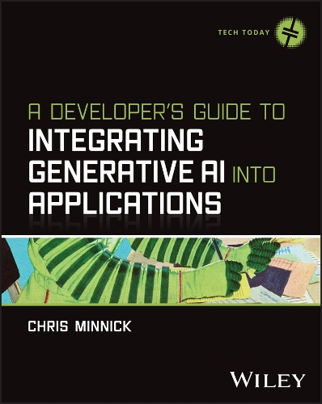

# A Developer's Guide to Integrating AI into Applications

<div align="center">



**Code Examples and Demos**

[](https://www.wiley.com)
[](https://www.wiley.com)
[](LICENSE)
[](https://github.com/chrisminnick)

</div>

## 📖 About This Book

This repository contains all the code examples, demos, and hands-on projects from **"A Developer's Guide to Integrating Generative AI into Applications"** by Chris Minnick, published by Wiley Publishing in 2026.

The book provides practical guidance for software developers who want to integrate AI capabilities into their applications, covering everything from basic API integration to advanced techniques like RAG (Retrieval-Augmented Generation), vector search, and production-ready AI systems.

### Book Details

- **Title**: A Developer's Guide to Integrating Generative AI into Applications
- **Author**: Chris Minnick
- **Publisher**: Wiley Publishing
- **Publication Year**: 2026
- **ISBN**: 9781394373130

## 🚀 What's Inside

This repository is organized by chapter and contains working examples of:

- **AI API Integration** - OpenAI, Anthropic, and Google Gemini integrations
- **Interactive Games** - 20 Questions, Choose Your Adventure, and Hangman powered by AI
- **Chat Applications** - Full-stack chat implementations with streaming
- **Content Generation** - Structured output and template-based generation
- **Code Optimization** - AI-assisted coding environments and optimization techniques
- **Production Tools** - SPOT (Structured Prompt Output Toolkit) for enterprise AI content
- **Vector Search** - Embedding-based search and recommendation systems
- **RAG Systems** - Retrieval-Augmented Generation implementations

## 📁 Repository Structure

```
├── chapter-02/          # RAG (Retrieval-Augmented Generation) concepts
├── chapter-03/          # Interactive AI games and demos
│   ├── 20-questions/    # AI-powered 20 Questions game
│   ├── choose-your-adventure/  # Interactive story game
│   └── hangman/         # AI word guessing game
├── chapter-04/          # Structured content generation
├── chapter-05/          # Recipe generator with Node.js
├── chapter-07/          # AI optimization examples and techniques
├── chapter-08/          # Chat applications
│   ├── simple-chat-python/     # Flask-based chat server
│   ├── chat-client-react-*/    # React chat clients
│   └── simple-chat-server-*/   # Node.js chat servers
├── chapter-09/          # Production AI tools
│   └── spot-toolkit/    # Enterprise content generation system
├── chapter-10/          # AI-assisted coding
│   └── pace/            # Prompt-Augmented Coding Environment
└── chapter-11/          # Vector search and recommendations
    ├── vector-search-demo/     # Embedding-based search
    ├── recommender-demo/       # AI recommendation system
    └── fuse/                   # Advanced search implementation
```

## 🛠️ Technologies Used

- **Languages**: Python, JavaScript/Node.js, TypeScript
- **Frameworks**: Flask, Express.js, React, Vite
- **AI Providers**: OpenAI GPT, Anthropic Claude, Google Gemini
- **Databases**: Vector databases, JSON storage
- **Tools**: CodeMirror, various AI SDKs

## 🎯 Featured Projects

### SPOT (Structured Prompt Output Toolkit)

_Chapter 9_

A production-ready content generation system featuring:

- Multi-provider AI support with automatic failover
- Brand voice enforcement and style governance
- Golden set testing and evaluation
- Circuit breakers and health monitoring
- Template management with versioning

### PACE (Prompt-Augmented Coding Environment)

_Chapter 10_

An AI-enhanced code editor that combines CodeMirror with customizable AI prompt templates for developer productivity.

### Interactive AI Games

_Chapter 3_

- **20 Questions**: AI acts as the answerer in the classic guessing game
- **Choose Your Adventure**: AI-generated interactive stories with branching narratives
- **Hangman**: AI provides words and hints for the classic word game

### Chat Applications

_Chapter 8_

Complete implementations showing:

- Real-time streaming responses
- Session management
- Full-stack architecture (Python Flask + React)
- WebSocket integration

### Vector Search & Recommendations

_Chapter 11_

- Embedding-based search systems
- User profile-driven recommendations
- Advanced search with the Fuse.js library

## 🚦 Getting Started

### Prerequisites

- Node.js 18+
- Python 3.8+
- API keys for at least one AI provider:
  - [OpenAI API Key](https://platform.openai.com/)
  - [Anthropic API Key](https://console.anthropic.com/)
  - [Google AI API Key](https://makersuite.google.com/)

### Quick Start

1. **Clone the repository**:

   ```bash
   git clone https://github.com/chrisminnick/ai-integration.git
   cd ai-integration
   ```

2. **Set up environment variables**:

   ```bash
   # Copy the example environment file (if available in specific chapters)
   export OPENAI_API_KEY="your-openai-api-key"
   export ANTHROPIC_API_KEY="your-anthropic-api-key"
   export GOOGLE_AI_API_KEY="your-google-ai-api-key"
   ```

3. **Run a demo** (example - 20 Questions game):

   ```bash
   cd chapter-03/20-questions
   pip install -r requirements.txt
   python server.py
   ```

4. **Visit** `http://localhost:5000` to try the demo

### Chapter-Specific Setup

Each chapter folder contains its own `README.md` with specific setup instructions. Most Python projects include a `requirements.txt` file, and Node.js projects include a `package.json` file for dependency management.

## 📚 Learning Path

If you're new to AI integration, we recommend following this order:

1. **Chapter 3** - Start with the interactive games to understand basic AI API calls
2. **Chapter 4** - Learn structured output and content generation
3. **Chapter 5** - Explore Node.js integration patterns
4. **Chapter 8** - Build full-stack chat applications
5. **Chapter 7** - Optimize performance and implement caching
6. **Chapter 9** - Scale to production with SPOT
7. **Chapter 10** - Enhance development workflow with PACE
8. **Chapter 11** - Implement advanced search and recommendations

## 🤝 Contributing

This repository primarily serves as companion code for the book, but we welcome:

- Bug reports and fixes
- Documentation improvements
- Additional examples or variations
- Performance optimizations

Please see individual project READMEs for specific contribution guidelines.

## 📄 License

This project is licensed under the MIT License - see the [LICENSE](LICENSE) file for details.

## 📧 Support

- **Book Support**: Contact Wiley Publishing for book-related questions
- **Code Issues**: Open an issue in this GitHub repository
- **Author Contact**: [Chris Minnick](https://github.com/chrisminnick)

## 🔗 Additional Resources

- [OpenAI API Documentation](https://platform.openai.com/docs)
- [Anthropic API Documentation](https://docs.anthropic.com/)
- [Google AI API Documentation](https://ai.google.dev/)
- [Wiley Publishing](https://www.wiley.com/)

## ⚖️ Copyright & License

### Book Copyright

**"A Developer's Guide to Integrating Generative AI into Applications"**  
© 2026 Wiley Publishing. All rights reserved.

### Code License

The code examples and demonstrations in this repository are open source and licensed under the MIT License. See the [LICENSE](LICENSE) file for full details.

**The book and its content are protected by copyright.** The code examples are provided for educational purposes to accompany the book and may be used, modified, and distributed under the terms of the MIT License.

---

<div align="center">

**Happy Coding! 🤖✨**

_Built with ❤️ for developers integrating AI into their applications_

</div>
